# Motivation

- Ecological studies are now embeded in the anthropocene
- Interconnected world
- Global environmental change
- Complex systems at global scales

# Overview

# Background: Anthropocene

- Humans = dominant global impact -> Anthropocene
- Indirect effecs and The far reach of the city
- Complex systems = many players and indirect effects matter

# A little money moves a lot of forest. 

- Tian et al. 2019 showed that China consumes an equivalent amount of
  domestic cropland as forest land, on the order of 10$^6$ km$^2$.
- Looking at the domestic landuse productivity data for China, forests
  have the lowest monetary productivity.
- Thus, per unit monetary output a relatively larger amount of forest
  land is used.
  
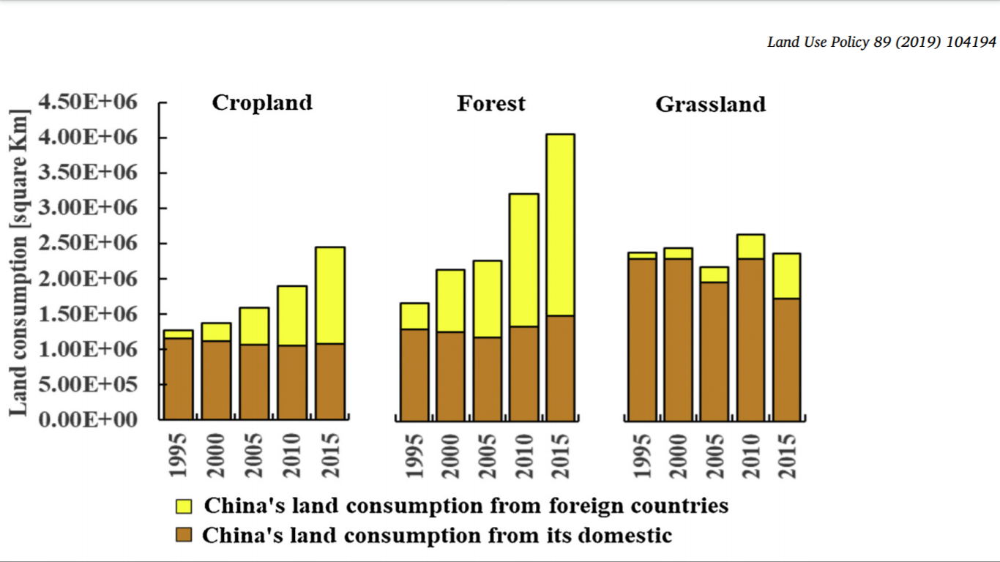

# A little money moves a lot of forest. 

- Tian et al. 2019 showed that China consumes an equivalent amount of
  domestic cropland as forest land, on the order of 10$^6$ km$^2$.
- Looking at the domestic landuse productivity data for China, forests
  have the lowest monetary productivity.
- Thus, per unit monetary output a relatively larger amount of forest
  land is used.

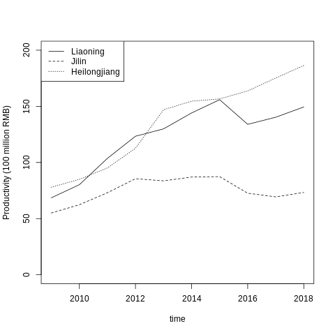

# Global Landuse Trade and China

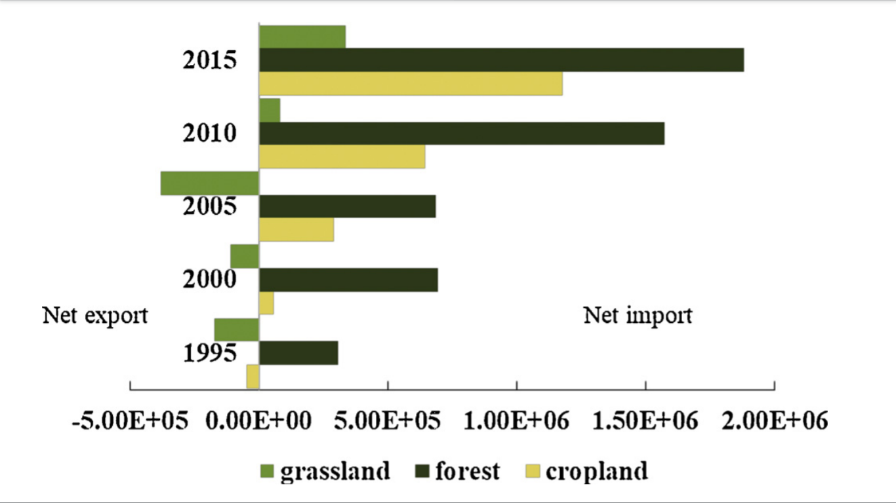 

# Global Landuse Trade and China

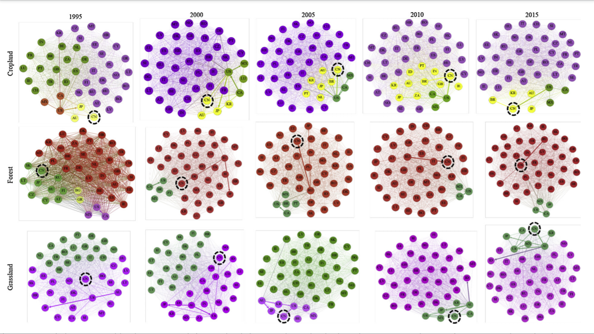 

# Background: Economy == Ecology

- Economic trade data is a window into human impacts

# Background: Input-Output Models

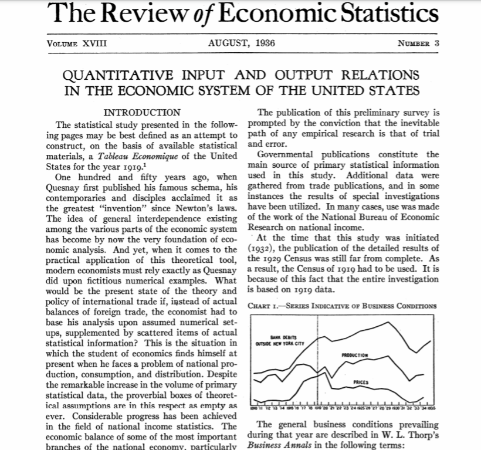

# Background: Input-Output Models

- How do we quantify and manage systems?
- Input-Output Analysis provides a modeling framework 
- Direct consumption
- Trade occurs among sectors == Indirect consumption
- IO and MRIO models
- A new equation for a new era in science E = F(I-A)^-1

# Background: Input-Output Models

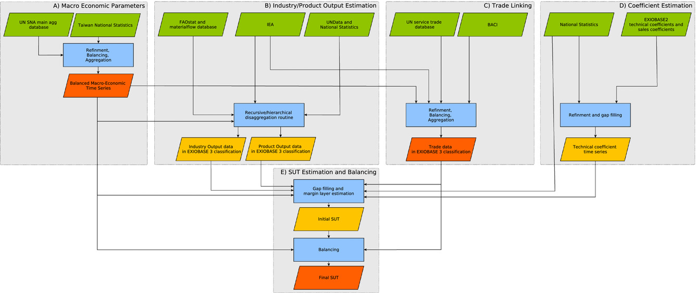

# Background: Environmental Extension

- Allows for indirect/consumption based accounting

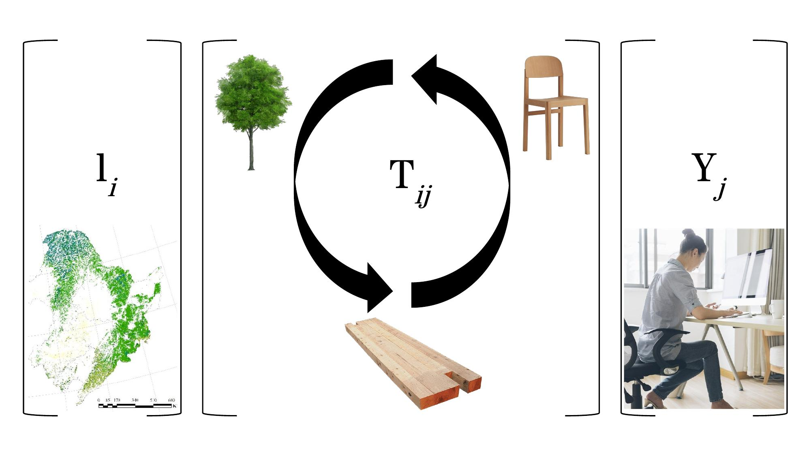

# Background: Environmental Extension

# wos_mrio_time.jpg

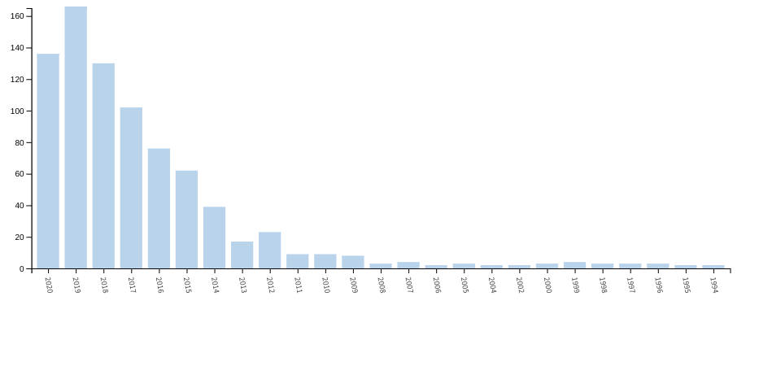

# wos_mrio_auth.jpg

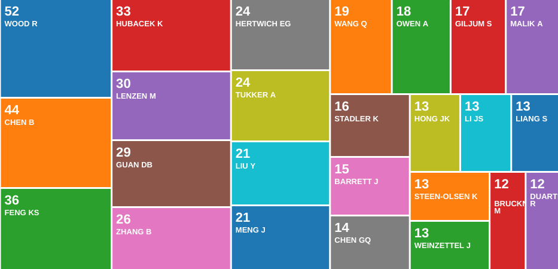

# wos_mrio_funding.jp

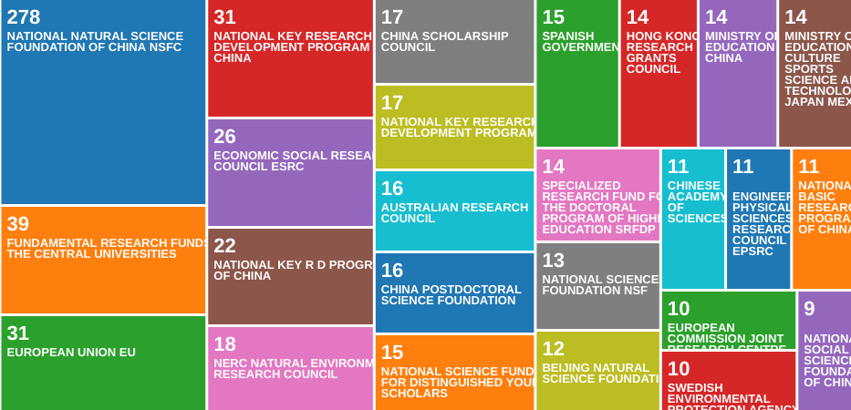

# wos_mrio_field.jp

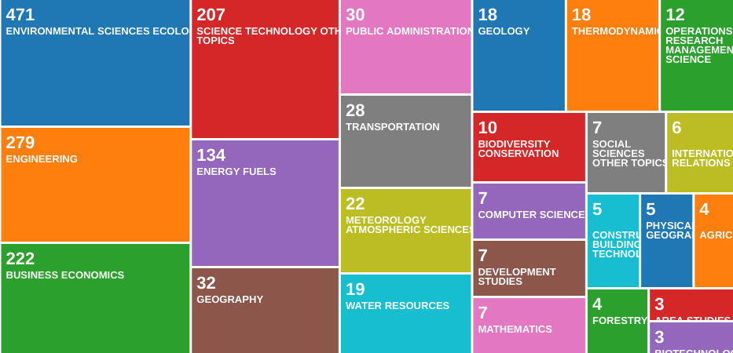

# wos_mrio_region.jpg

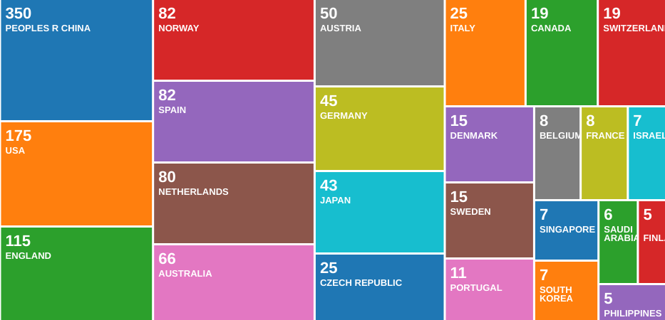

# Background: Networks are Everywhere

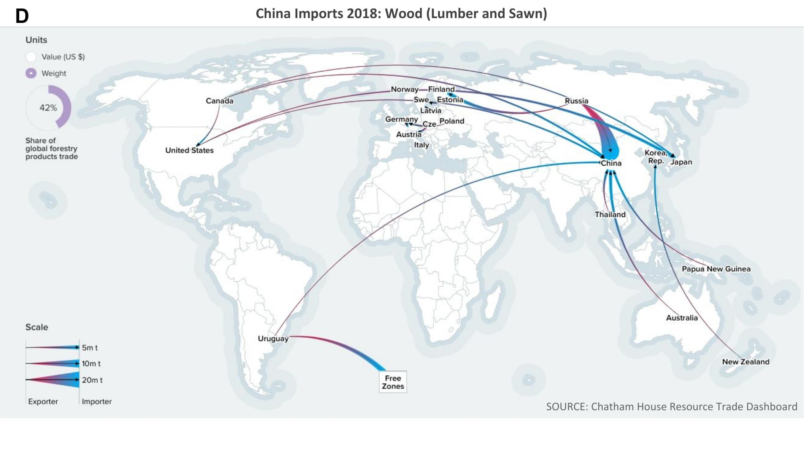

# Background: Networks are Everywhere

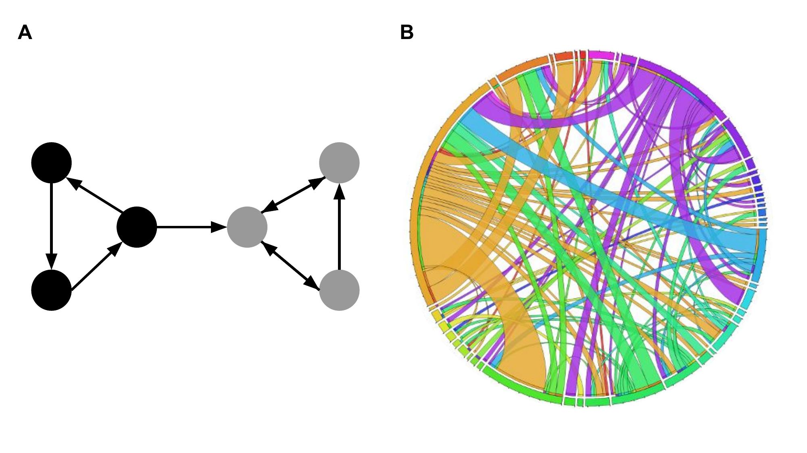

# Background: Ecological Network Analysis

- Ecological network theory provides predictions and metrics (Lau 2017)
- Systems theory provides strategies for inteventions
- ENA <- Odums, MacArthur, Ulanowicz, Patten,
- SNA -> ecological networks (Watts and Strogatz, etc.)
- Structure linked to function (Donella Meadows)

# Which metric?
# Why information metrics?
# Research: Why Chinese Forests?

- Work = Forest Land Embodied in Trade

# A Brief History of Forest Time in China

- China is big and diverse
- Long history of human habitation in China
- Historically, two primary regions of forestry
- Forest conservation impacts harvest
- Flows within China and among countries globally important

# Research: Why Chinese Forests?

# Research: Why Chinese Forests?

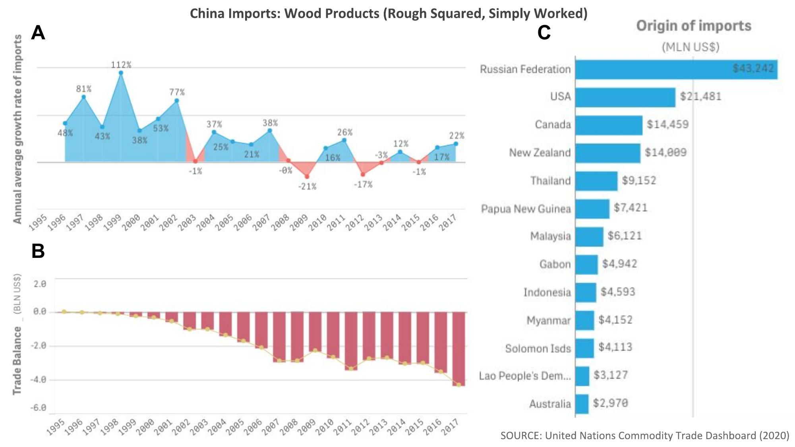

# Methods: Model MRIO$_{China}$

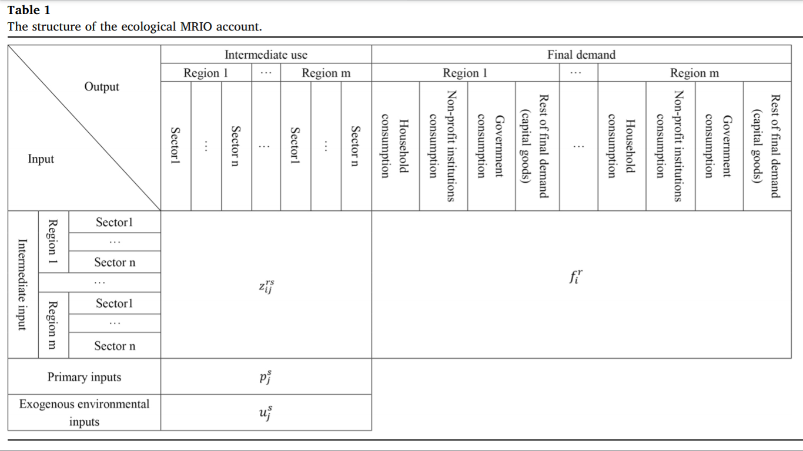

# Methods: Model Source

# Main Focus of Research

1. What research has been done on forest or forest landscape embodied
networks?
2. What is the network structure? How can we characterize it?
3. What can we say about the potential system dynamics based on
   network structure?

# Research: Network Analysis

- LEMRIO global (Tian 2019)
- LEMRIO local (Chen 2019)
- Your LE-MRIO China
- Your ENA analysis
  - Small world
  - Modularity
  - Centrality
  - Control
  - Resilience

# Research: Structural Analysis

- Analysis = Structure = Robustness

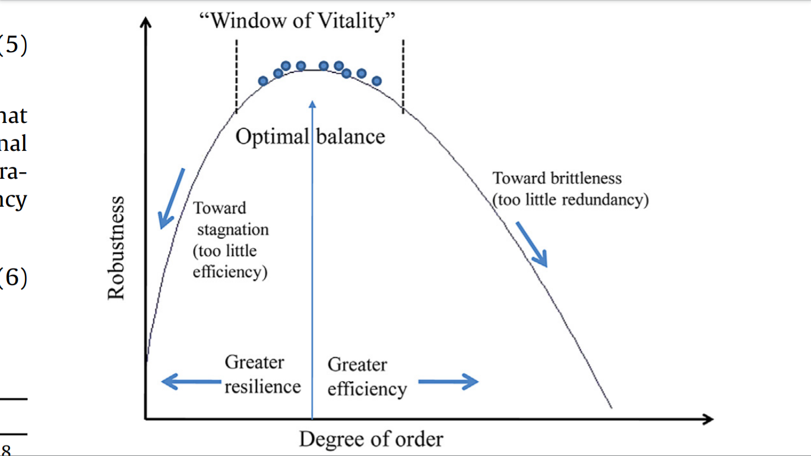

# Caveats

- Limitations of MRIO
- Potential impacts of storage lags and buffers

# Future: Next up, climate change variability

- Next up = Climate change impacts and global scale

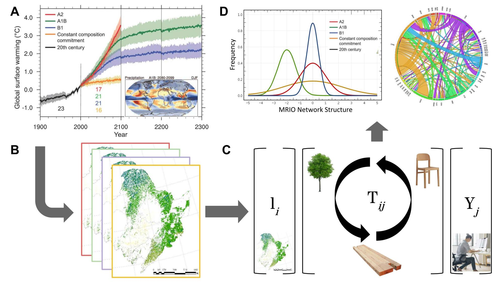

# Future: Next up, climate change variability

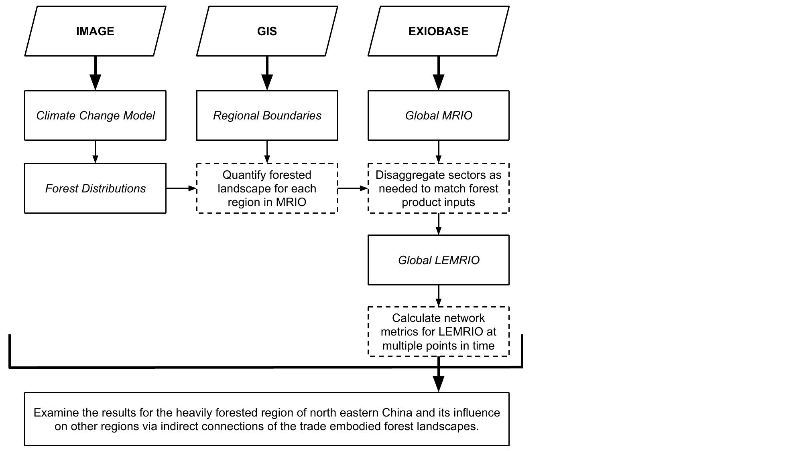

# Future Work: Remote Sensing Trade Models

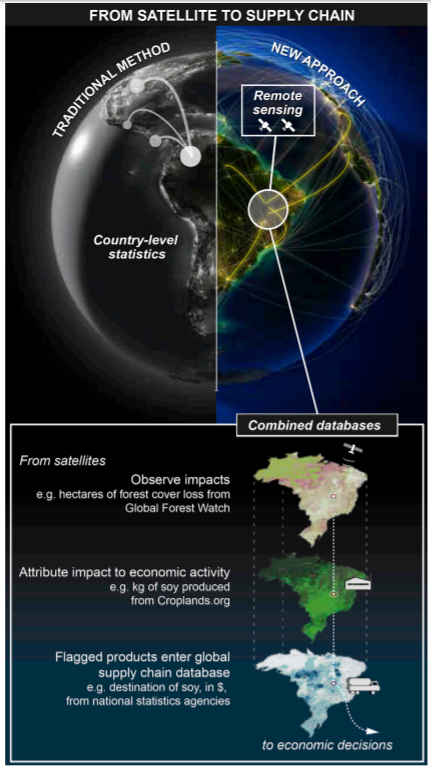

# Q & A

*This talk was made via Rmarkdown*
